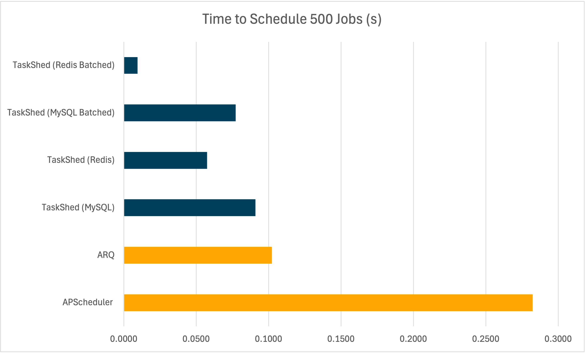
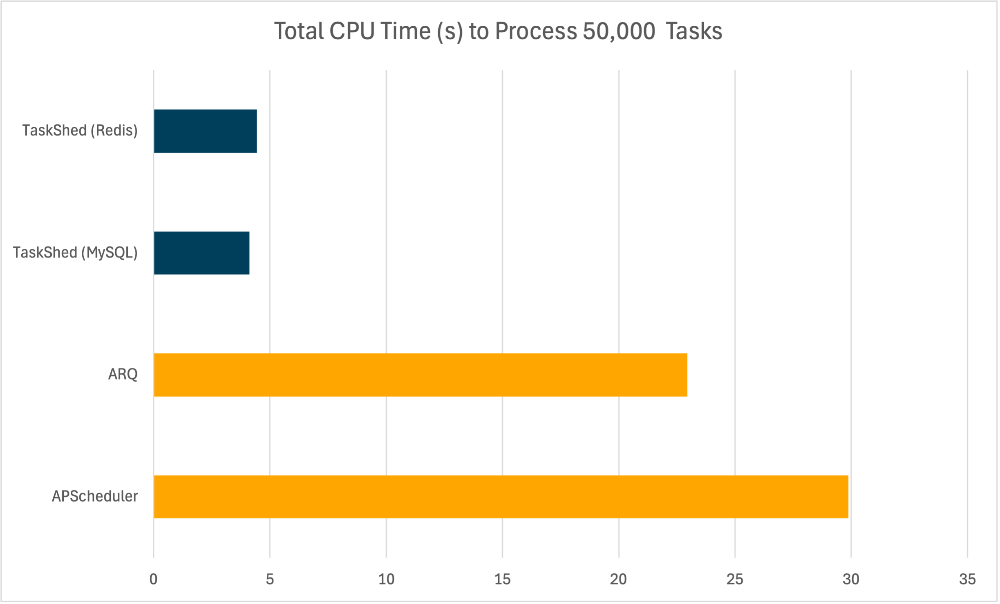
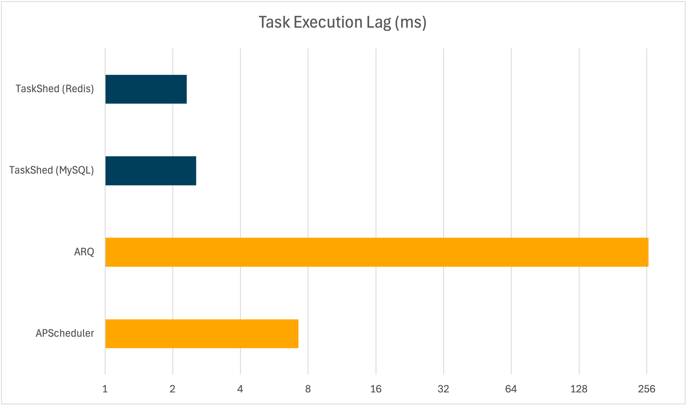

# Benchmarks

TaskShed was benchmarked against two established asynchronous and persistent task scheduling libraries - `APScheduler` and `ARQ` to assess performance in selected areas.

The benchmarks were run on a **MacBook Air (M1, 2020) with macOS Sonoma**. They have not been independently verified. The primary aim was to provide a transparent, reproducible comparison of `TaskShed`’s performance under specific test conditions.

All code for these benchmarks is available in the [tests/benchmarks](https://github.com/Chase-Labs/taskshed/tree/main/tests/benchmarks) directory of the `TaskShed` repository.

## Time to Schedule 500 Jobs (s)

This test measures how long each framework takes to schedule 500 jobs. Faster scheduling is particularly relevant for applications that dynamically create large numbers of tasks.

In these tests, `TaskShed` scheduled jobs in less time than `APScheduler` and `ARQ`. The batched scheduling features of `TaskShed` (using either Redis or MySQL) showed especially low scheduling times.

## Total CPU Time (s) to Process 50,000 Tasks

This benchmark measures the total CPU time required to process 50,000 tasks. Lower CPU time can indicate higher resource efficiency, which may be beneficial in terms of operational cost and energy use.

In these measurements, `TaskShed` used less CPU time than the other tested frameworks.

## Task Execution Lag (ms)

Execution lag refers to the time difference between a task’s scheduled execution and its actual start time. Lower lag indicates that tasks are executed closer to their intended schedule.

Again, `TaskShed` recorded lower execution lag than `APScheduler` and `ARQ`.

