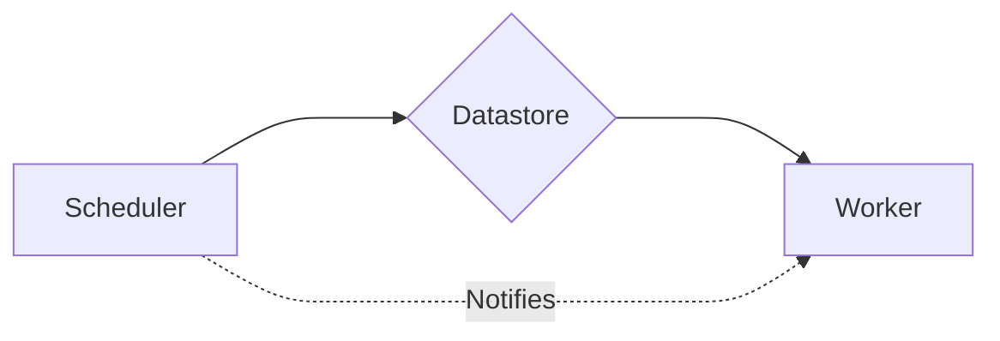

# Key Conecpts

There are three central and configurable components of TaskShed:

* **Scheduler**: Acts as an API for developers to perform CRUD operations on jobs. It additionally has the responsibility of informing other components of changes (for instance if a new job has been submitted).
* **Datastore**: A data access object that stores the jobs. This could be purely in-memory datastores or a persistant storage such as `Redis` or `SQL`.
* **Worker**: The component responsible for executing the jobs. It pulls due jobs from the datastore and submits them to the event loop.

