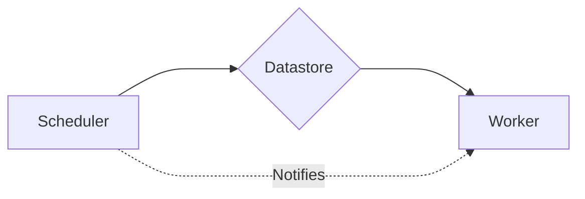

# Key Conecpts

There are three central and configurable components of TaskShed:

* **Scheduler**: Acts as an API for developers to perform CRUD operations on tasks. It additionally has the responsibility of informing other components of changes (for instance if a new task has been submitted).
* **Datastore**: A data access object that stores the tasks. This could be purely in-memory datastores or a persistant storage such as `Redis` or `SQL`.
* **Worker**: The component responsible for executing the tasks. It pulls due tasks from the datastore and submits them to the event loop.



# Schedulers

The only available scheduler at present is the `AsyncScheduler`. This works with a running event loop and all it's methods are coroutines.

It requires a datastore and _optionally_ accepts an `EventDrivenWorker`.

``` py title="AsyncScheduler" linenums="0" hl_lines="12 16"
from taskshed.datastores import RedisDataStore
from taskshed.schedulers import AsyncScheduler
from taskshed.workers import EventDrivenWorker


async def add(a, b):
    return a + b


datastore = RedisDataStore()
worker = EventDrivenWorker(callback_map={"add": add}, datastore=datastore)
scheduler = AsyncScheduler(datastore=datastore, worker=worker)


async def main():
    await scheduler.start()
    await worker.start()
```

We also need to call the `start()` method before we can start scheduling tasks.

## Scheduling Tasks

To create a task you simply call the `add_task()` method, passing in the `callback` string, a `run_at` datetime and optional keyword arguments to be passed to the target function.

```py title="One-off Task"
await scheduler.add_task(
    callback="add",
    run_at=datetime.now() + timedelta(seconds=5),
    kwargs={"a": 1, "b": 2},
)
```

??? info "String Callbacks"

    Rather than accepting the callback function directly, a **Task** take in a string that points to the eventual callback coroutine defined in the **Worker** `callback_map`. While slightly more cumborsome than passing in a function directly, there are two good reasons for this design:

    1. **Distributed Architecture**: The **Scheduler** and **Worker** can operate completely independently of one another. This means that you could have a **Scheduler** exist on one machine, and potentially many distribted **Worker**(s) on any number of other machines.
    2. **Serialization**: Tasks are stored as JSON in the datastores, this is considerably simpler and faster than using Python serialization libraries such as `pickle` - which is volatile to code changes.

You can also create **recurring** tasks by specifying the `run_type` and passing in an `interval`:

```py title="Recurring Tasks" hl_lines="5-6"
await scheduler.add_task(
    callback="add",
    run_at=datetime.now() + timedelta(seconds=5),
    kwargs={"a": 1, "b": 2},
    run_type="recurring",
    interval=timedelta(seconds=10),
)
```

In the above example, the `add()` coroutine is scheduled to run in 5 seconds, and then once every 10 seconds.

You can also efficiently schedule multiple tasks at once using the `add_tasks()` method. Unlike the `add_task()` method, this method accepts an iterable of `Task` objects.

```py title="Scheduling Many Tasks" hl_lines="9-10"
from taskshed.models import Task


tasks = [
    Task(
        callback="add",
        run_at=datetime.now() + timedelta(seconds=i * 10),
        kwargs={"a": 1, "b": 2},
        task_id=f"task-{i}",
        group_id="adding_numbers",
    )
    for i in range(5)
]

await scheduler.add_tasks(tasks)
```

This will schedule all tasks in a single trasaction and therefore is almost always more efficient than calling `add_task()` in a loop.

In addition to showcasing how to schedule many tasks, the above example also showed two optional ways of identifying tasks: `task_id` and `group_id`.

* The `task_id` must be unique and can be used to fetch, modify and delete a single task, whereas
* The `group_id` does not have to be unique and is used to perform operations on a group of tasks.

## Fetching, Pausing, Resuming and Deleting Tasks

The API for fetching, pausing, resuming and deleting tasks are the same. Each method accepts either an *iterable* (list, tuple, set, etc.) of `task_id` or a single `group_id`. For example, to fetch all our **adding_number** tasks we simply call:

```py title="Fetching Tasks"
add_tasks = await scheduler.fetch_tasks(group_id="adding_numbers")
```

We can also pause tasks by calling the `pause_tasks()` method. This will suspend the execution of these tasks until the `resume_tasks()` is called.

```py title="Pausing and Resuming Tasks"
await scheduler.pause_tasks(task_ids=["task-1", "task-2"])
await scheduler.resume_tasks(task_ids=["task-1", "task-2"])
```

